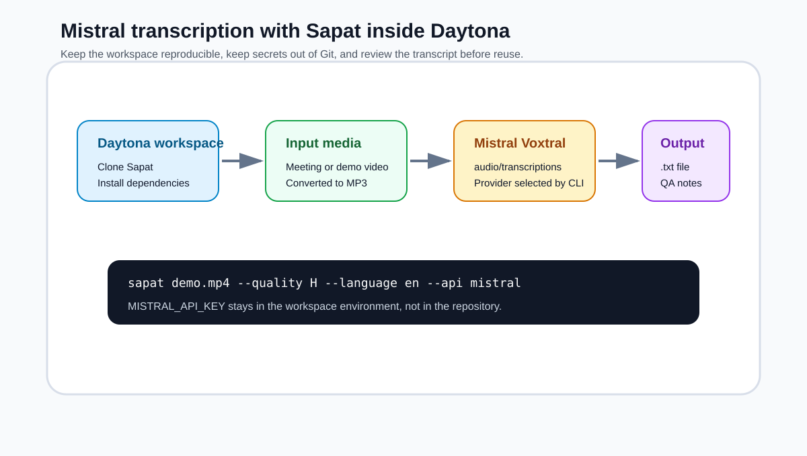

# Transcribe with Mistral in Daytona

# Introduction

Audio is one of the most useful inputs for AI engineering work, but it is also one of the easiest to lose track of. A product demo, customer call, incident review, or internal design discussion may contain the exact detail a team needs, yet the information often stays locked inside an MP4 file.
The first practical step is not summarization. It is turning the recording into a transcript that is easy to inspect, correct, and reuse.

[Sapat](https://github.com/nibzard/sapat) is a Python command-line tool for that job. It converts video files to MP3 with `ffmpeg`, sends the audio to a selected [speech-to-text provider](../definitions/20260514_definition_speech_to_text_provider.md), and writes the transcript next to the media file.
The project already supports OpenAI, Azure OpenAI, and Groq. This guide shows how to run the same workflow with Mistral's Voxtral transcription endpoint from a reproducible [Daytona workspace](../definitions/20240819_definition_daytona%20workspace.md).

The companion Sapat contribution for this guide adds `--api mistral` support in [nibzard/sapat#16](https://github.com/nibzard/sapat/pull/16). It uses Mistral's documented `POST /v1/audio/transcriptions` API and the `voxtral-mini-latest` model described in the official Mistral audio transcription documentation.



## TL;DR

- Create a Daytona workspace from the Sapat repository so every run starts from the same tools and dependencies.
- Keep `MISTRAL_API_KEY` in the workspace environment or `.env` file, never committed to Git.
- Run Sapat with `--api mistral` to send the converted audio to Mistral's Voxtral transcription endpoint.
- Review the transcript before using it in summaries, release notes, customer handoffs, or retrieval pipelines.
- Use a short smoke test file first, then process longer directories only after the provider settings are verified.

## What You Are Building

The workflow has four moving parts:

| Layer | Responsibility | Why it matters |
| --- | --- | --- |
| Daytona | Creates a consistent workspace from the GitHub repository | Prevents "works on my machine" setup drift |
| Sapat | Converts video to MP3 and writes transcript files | Keeps the transcription workflow simple and repeatable |
| Mistral Voxtral | Transcribes the uploaded audio file | Adds another provider option for teams comparing quality, cost, or latency |
| Review artifacts | Transcript, notes, and optional correction output | Makes the result useful to humans and downstream AI systems |

This is intentionally not a full media platform. It is a lightweight developer workflow. That makes it useful when an AI engineer needs to inspect a few recordings, prepare evidence for an issue, create a transcript corpus, or test provider behavior before building a larger service.

## Prerequisites

You need:

- A Daytona installation or Daytona-managed workspace environment.
- A Mistral API key with access to audio transcription.
- `ffmpeg`, because Sapat converts media files to MP3 before transcription.
- Python 3 and the Sapat dependencies from `requirements.txt`.
- One short MP4 file for a first validation run.

In a real team workflow, keep secrets in the workspace environment or a local `.env` file. Do not paste API keys into Markdown, commits, screenshots, logs, or pull request comments.

## Create the Daytona Workspace

Start by creating a workspace from the Sapat repository:

```bash
daytona create https://github.com/nibzard/sapat --code
```

Open the workspace terminal and install the project dependencies:

```bash
pip install -r requirements.txt
```

Check that `ffmpeg` is available:

```bash
ffmpeg -version
```

If `ffmpeg` is missing, install it in the workspace image or Dev Container configuration before you process real media. Sapat can prepare API requests, but it cannot extract audio from video without `ffmpeg`.

## Configure Mistral

Create a `.env` file in the workspace. The companion Sapat PR adds these variables to `.env.example`:

```bash
MISTRAL_API_KEY=your_mistral_api_key_here
MISTRAL_MODEL=voxtral-mini-latest
MISTRAL_API_ENDPOINT=https://api.mistral.ai/v1/audio/transcriptions
MISTRAL_MODEL_NAME_CHAT=mistral-small-latest
MISTRAL_CHAT_API_ENDPOINT=https://api.mistral.ai/v1/chat/completions
```

The two most important values are `MISTRAL_API_KEY` and `MISTRAL_MODEL`. The endpoint defaults to Mistral's hosted API. The chat variables are used only when you ask Sapat to run the optional correction pass with `--correct`.

Use this quick rule:

- Use `--api mistral` when you want Voxtral transcription through Mistral.
- Use `--language` when you know the recording language and want to help the provider.
- Use `--quality H` for recordings where clarity matters more than conversion speed or temporary file size.
- Use `--correct` only after a raw transcript run works, because correction makes another model call.

## Run a Smoke Test

Before processing a full folder of recordings, run one short file:

```bash
sapat demo.mp4 --quality H --language en --api mistral
```

Sapat will:

1. Convert `demo.mp4` into `demo.mp3`.
2. Send the MP3 to the configured Mistral audio transcription endpoint.
3. Save the transcript as `demo.txt`.
4. Remove the temporary MP3 file.

Open the transcript and check the first few paragraphs:

```bash
sed -n '1,80p' demo.txt
```

On Windows PowerShell, use:

```powershell
Get-Content .\demo.txt -TotalCount 80
```

This manual read is not busywork. It catches the most common problems early: wrong language, poor source audio, missing names, overly compressed audio, or an API key that points to the wrong account.

## Process a Folder

After the short test works, place related MP4 files in one folder:

```text
recordings/
  customer-demo-01.mp4
  customer-demo-02.mp4
  sprint-review.mp4
```

Then run:

```bash
sapat recordings --quality M --language en --api mistral
```

Sapat processes every `.mp4` file in that directory and writes a `.txt` file beside each one. A simple folder convention keeps the work reviewable:

```text
recordings/
  customer-demo-01.mp4
  customer-demo-01.txt
  customer-demo-02.mp4
  customer-demo-02.txt
  sprint-review.mp4
  sprint-review.txt
```

Do not jump directly from transcript to final AI summary. Instead, keep a small review note beside the transcript:

```text
customer-demo-01.review.md
```

Use it to record:

- The provider and model used.
- Whether the source audio had background noise.
- Names, products, or acronyms that needed correction.
- Any section that should not be shared outside the team.
- Whether the transcript is approved for downstream summarization or search.

That review note makes the transcript useful later, especially when another teammate needs to know whether the file is raw, corrected, or publication-ready.

## Add Context Without Leaking Secrets

Sapat exposes a `--prompt` option. For Mistral, the companion implementation maps this to Mistral's context bias concept so you can give the transcription model domain hints.

Example:

```bash
sapat incident-review.mp4 \
  --quality H \
  --language en \
  --prompt "Product names: Daytona, Sapat, Voxtral. Team names: platform, growth." \
  --api mistral
```

Keep the prompt factual and short. Good context bias looks like a vocabulary card, not an essay. Avoid putting customer secrets, credentials, private URLs, or sensitive incident details in the prompt unless your team has explicitly approved that data flow.

## Optional Correction Pass

Once raw transcription works, you can run:

```bash
sapat demo.mp4 --quality H --language en --api mistral --correct
```

The correction pass is useful when the transcript is nearly right but has inconsistent capitalization, punctuation, or product spelling. It is not a substitute for review. Treat corrected transcripts as edited drafts, not as a legal or compliance record.

A good review checklist:

| Check | What to look for |
| --- | --- |
| Names | People, products, and company names are spelled consistently |
| Numbers | Dates, amounts, metrics, and version numbers match the recording |
| Missing sections | Long pauses or low-volume parts did not disappear |
| Sensitive content | Personal data and credentials are removed before sharing |
| Downstream use | The transcript is approved for summaries, RAG, or issue handoff |

## Troubleshooting

**`ffmpeg` is not found**

Install `ffmpeg` in the Daytona workspace or Dev Container. Sapat needs it before any provider call happens.

**The transcript file is empty**

Check that the source recording has an audio track, that the temporary MP3 can be produced, and that the Mistral request succeeded. Start with a shorter test recording so the failure is easier to inspect.

**The API returns an authentication error**

Confirm that `MISTRAL_API_KEY` is present in `.env` or the workspace environment. Do not print the key in the terminal or paste it into a GitHub comment.

**The transcript has the wrong language**

Pass `--language` explicitly:

```bash
sapat interview.mp4 --language fr --api mistral
```

**The transcript misses product names**

Add a short `--prompt` with expected vocabulary. Keep it limited to words that help recognition.

## When to Use Mistral Instead of Another Provider

Provider choice is an engineering decision, not a loyalty test. Mistral is a useful option when your team wants to compare Voxtral against OpenAI, Azure OpenAI, or Groq using the same Sapat workflow.
Because the CLI shape stays the same, you can run the same short recording through different providers and compare output quality.

For example:

```bash
sapat demo.mp4 --quality H --language en --api openai
sapat demo.mp4 --quality H --language en --api groq
sapat demo.mp4 --quality H --language en --api mistral
```

Save each output with a clear name before running the next provider, or run separate copies of the file in separate folders. Compare the transcripts for proper nouns, timestamps if available, punctuation quality, and hallucinated text.

## Turn the Command into a Team Runbook

The command is only the first layer. A reusable team process should describe who runs the transcription, which inputs are allowed, where the output goes, and how the transcript is approved.
Without that runbook, people will make different choices every time and the resulting transcript folder will become hard to trust.

Start with a small `TRANSCRIPTION_RUNBOOK.md` inside the workspace or project repository. Keep it practical:

```markdown
# Transcription Runbook

Provider: Mistral
Model: voxtral-mini-latest
Command: sapat recordings --quality M --language en --api mistral

Before running:
- Confirm the recording is approved for transcription.
- Confirm MISTRAL_API_KEY is set in the workspace, not committed.
- Run one short smoke test if the source format is new.

After running:
- Open the first transcript and spot-check names and numbers.
- Add a review note for each transcript.
- Move approved transcripts to the handoff folder.
```

This file is simple, but it gives reviewers a shared checklist. It is also useful when the workflow becomes part of a larger AI system. If another agent later summarizes these transcripts, the runbook explains how the text was produced and what review steps happened before the summary.

## Organize Outputs for Downstream AI Work

A transcript is rarely the final artifact. It usually feeds a second workflow: product notes, bug reports, sales call summaries, release notes, or retrieval-augmented generation. The folder layout should make that next step predictable.

One workable layout:

```text
recordings/
  raw/
    sprint-review-2026-05-14.mp4
  transcripts/
    sprint-review-2026-05-14.mistral.raw.txt
    sprint-review-2026-05-14.review.md
  approved/
    sprint-review-2026-05-14.approved.txt
```

The naming is deliberately boring. It records the date, provider, and review state in the filename. That matters when teams compare different providers or rerun the same recording after changing the prompt.

Use the review file for the human judgment that the model cannot provide:

```markdown
# sprint-review-2026-05-14 review

Provider: Mistral
Model: voxtral-mini-latest
Language: en
Audio quality: clear, one speaker remote
Known vocabulary: Daytona, Sapat, Voxtral

Review result:
- Product names checked
- Action items checked
- No credentials or personal data found
- Approved for engineering summary
```

If the transcript will be chunked for search or RAG, approve the transcript before chunking it. Chunking a bad transcript only spreads the error across more files.

## Control Cost and Batch Size

Audio transcription can become expensive when a directory contains long recordings. A reproducible workspace should include a simple policy for how much work runs in one batch. The goal is not perfect accounting. The goal is to prevent accidental full-folder runs when someone only meant to test one file.

Start with a smoke test rule:

- First run one recording under five minutes.
- Confirm the output and provider settings.
- Process at most five files in the next batch.
- Only then run the full folder.

If your recordings are long, use `ffprobe` to estimate duration before transcription:

```bash
ffprobe -v error -show_entries format=duration \
  -of default=noprint_wrappers=1:nokey=1 recordings/raw/demo.mp4
```

You can keep a tiny manifest:

```csv
file,duration_seconds,provider,status
demo.mp4,184,mistral,approved
customer-call.mp4,2410,mistral,pending-review
```

This makes the transcription workflow easier to audit. It also helps teams decide whether a high-quality setting is worth using on every file or only on recordings with poor audio.

## Quality Gates Before Summarization

A common mistake is to transcribe a recording and immediately ask an LLM to summarize it. That can work for informal notes, but it is risky for engineering evidence. A transcript with one wrong version number can produce a confident but false summary.

Use three quality gates:

| Gate | Question | Pass condition |
| --- | --- | --- |
| Source gate | Is this recording allowed to leave the team workspace? | The owner approves transcription and sharing rules |
| Transcript gate | Does the text match the recording? | Names, numbers, and key decisions are spot-checked |
| Handoff gate | Is the transcript safe for downstream AI? | Sensitive content is removed or marked before reuse |

For product teams, the handoff gate is especially important. Customer recordings may include names, emails, account identifiers, pricing discussions, or unreleased roadmap details. Keep those out of public issues and public pull requests.

## Make Provider Comparisons Fair

If you compare Mistral with another provider, keep the test conditions identical:

- Use the same source file.
- Use the same converted quality setting.
- Use the same language hint.
- Use the same vocabulary prompt, or no prompt for every provider.
- Compare raw transcripts before any correction pass.

Then evaluate the result with concrete criteria:

| Criterion | What to inspect |
| --- | --- |
| Proper nouns | Company, product, and feature names |
| Technical vocabulary | API names, package names, command names |
| Numbers | Dates, prices, counts, model names, versions |
| Structure | Paragraph breaks and sentence boundaries |
| Safety | Whether the model invents missing content |

This gives a team a more honest answer than "provider A felt better." It also creates a repeatable benchmark for future provider changes.

## Secure the Workflow

The security rule is simple: transcripts can be sensitive, and API keys are always sensitive. Treat both carefully.

Use these defaults:

- Add `.env` to `.gitignore`.
- Keep raw recordings and transcripts out of public repositories unless they are explicitly approved.
- Avoid printing environment variables in terminal logs.
- Use separate keys for development and production workflows.
- Rotate a key if it appears in a screenshot, issue, or commit.

For public content contributions, show placeholder values only:

```bash
MISTRAL_API_KEY=your_mistral_api_key_here
```

Do not include real recordings in the PR. A guide can explain the workflow without exposing private media.

## Conclusion

The most valuable transcription workflow is not the flashiest one. It is the one a teammate can rerun next week without guessing which tool, model, prompt, or API key was used.
Daytona provides the reproducible workspace. Sapat provides the small command-line surface. Mistral adds another modern speech-to-text provider through Voxtral.

With the companion Sapat provider PR, the workflow becomes:

```bash
sapat demo.mp4 --quality H --language en --api mistral
```

From there, the important work is operational discipline: keep secrets out of Git, validate one short file before batch runs, review transcripts before downstream AI use, and record enough metadata that future readers trust the output.

## References

- [Sapat repository](https://github.com/nibzard/sapat)
- [Companion Sapat Mistral provider PR](https://github.com/nibzard/sapat/pull/16)
- [Mistral audio transcription API](https://docs.mistral.ai/api/endpoint/audio/transcriptions)
- [Mistral speech-to-text documentation](https://docs.mistral.ai/studio-api/audio/speech_to_text)
- [Daytona content contribution guide](../CONTRIBUTING.md)
